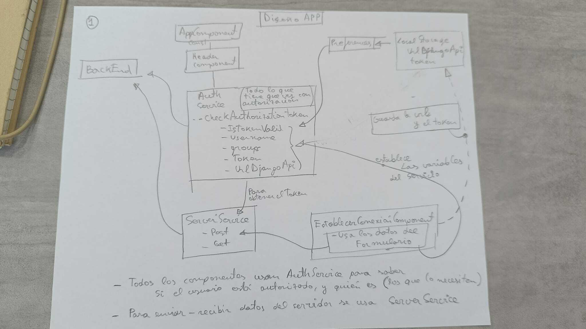

# Bienvenido a la app móvil del proyecto Metatierras Colombia

Metatierras Colombia es un proyecto ADSIDEO financiado por el área de cooperación al desarrollo de la <a href='https://www.upv.es/'>Universitat Politècnica de València</a>, 
y realizado en colaboración con la <a href='https://www.forjandofuturos.org/'> Fundación Forjado Futuros</a>, y con la <a href="https://www.acpp.com/">Asamblea de Cooperación por la Paz</a>.

El objetivo del proyecto es diseñar software libre para la agilización de la regularización 
de tierras rústicas en Colombia.

Este repositorio contiene parte de la implementación del diseño de una aplicación móvil que captura imágenes y coordenadas, según el modelo LADM-COL.

Esta aplicación guarda los datos capturado en el móvil hasta que se envían a un servidor para ser estudiados por expertos. La implementación de la API e el servidor se puede encontrar en <a href="https://github.com/joamona/metatierrascol-api">código fuente de la API</a>.

# Vídeos demostrativos

- Uso de la app para la toma de datos: datos del predio, propietarios, y medición del perímetro: https://media.upv.es/player/?id=57bc4170-0d1e-11ef-a769-7f9c22a58452
- Envío de datos desde la app al servidor: https://media.upv.es/player/?id=973dbb80-0d1e-11ef-a769-7f9c22a58452
- Descarga de datos y visualización: https://media.upv.es/player/?id=cd5f9cb0-0d1e-11ef-9b06-df984097a654
- Gestión de usuarios: https://media.upv.es/player/?id=017b74b0-0d1f-11ef-9b06-df984097a654
- Gestión de las sesiones de usuario: https://media.upv.es/player/?id=6760a930-0d1f-11ef-9b06-df984097a654

# Desarrolladores de la app

    Diego Terevinto Charquero
    Gaspar Mora-Navarro

# Detalles técnicos de la implementación

La app ha sido realizada con Angular 17 + Capacitor + Ionic. La versión de node utilizada es 20.11.0.

Para el desarrollo, es necesario instalar primero Android Studio.
Clonar el repo y, desde la carpeta del proyecto:

    npm install
    ionic cap add android
    npx cap sync
    ionic build
    npx cap copy web
    ionic serve

Para abrir la app en Android Studio:

    ionic cap build android

Si se abre Android Studio, perono se abre el proyecto en Android Studio, 
a veces es necesario reinstalar ionic:

    npm uninstall -g ionic
    npm install -g @ionic/cli

## Esquema de autenticación

  